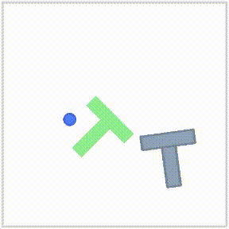

# Bidirectional Decoding

**[`Website`](https://bid-robot.github.io) | [`Paper`](https://arxiv.org/abs/2408.17355) | [`BiD + LeRobot`](https://github.com/Jubayer-Hamid/bid_lerobot) | [`BiD + DP`](https://github.com/YuejiangLIU/bid_dp)**

This repo contains the official implementation of \
Bidirectional Decoding: Improving Action Chunking via Closed-Loop Resampling. \
<a href="https://sites.google.com/view/yuejiangliu/">Yuejiang Liu*</a>,
<a href="https://jubayer-hamid.github.io/">Jubayer Ibn Hamid*</a>,
<a href="https://anxie.github.io/">Annie Xie</a>,
<a href="https://yoonholee.com//">Yoonho Lee</a>,
<a href="https://maximiliandu.com/">Maximilian Du</a>,
<a href="https://ai.stanford.edu/~cbfinn/">Chelsea Finn</a> \
IRIS Lab, Stanford University

> Bidirectional Decoding (BID) samples multiple action chunks at each time step and searches for the optimal action based on two criteria:
>   1. backward coherence, which favors actions close to the decision made in the previous time step
>   2. forward contrast, which favors actions close to near-optimal long-horizon plans and far from sub-optimal short-horizon ones
> 
> By coupling decisions within and across action chunks, BID improves temporal consistency over multiple time steps while maintaining high reactivity to unexpected states in stochasticity environments.

### Setup

Install dependencies of the diffusion policy (approx. 20 min)
```
mamba env create -f conda_environment.yaml
mamba activate bid
```

Install additional dependencies
```
pip install -r requirement.txt
```

Download pre-trained checkpoints
```
gdown https://drive.google.com/drive/folders/1o8rf2Lq91D_DCq7RqZVyFAP-eMcLOAP2 -O . --folder
```

Download [online data](https://diffusion-policy.cs.columbia.edu/data/training/) (optional, required only for model training)
```
bash script/download_dataset.sh
```

### Decoding Scripts

The [sampler](diffusion_policy/sampler) folder contains a collection of test-time sampling/decoding algorithms.

- Vanilla Sampling Baseline
```
bash script/eval_random.sh
```

- Warmstart Diffusion Baseline
```
bash script/eval_warmstart.sh
```

- Temporal Ensembling Baseline (EMA)
```
bash script/eval_ema.sh
```

- Our Bidirectional Decoding (BID)
```
bash script/eval_bid.sh
```

- Animation comparison
```
bash script/animate_eval.sh
```

### Expected Results

The [notebook](notebook/dp.ipynb) script summarizes representative results from different algorithms for the Pust-T task in deterministic and stochastic environments.

- Deterministic action (`noise=0.0`)

|method|result|
|:----|:----|
|Vanilla (ah=1)|0.846|
|Vanilla (ah=8)|0.884|
|Warmstart (ah=8)|0.875|
|EMA (ah=8)|0.860|
|BID (ah=8)|**0.916**|

- Stochastic action (`noise=1.0`)

|method|result|
|:----|:----|
|Vanilla (ah=8)|0.582|
|Vanilla (ah=1)|0.805|
|Warmstart (ah=1)|0.836|
|EMA (ah=1)|0.822|
|BID (ah=1)|**0.870**|

- Dynamics object (`perturb=1.0`)

| Vanilla Open-Loop          | Vanilla Closed-Loop       | EMA Closed-Loop        | BID Closed-Loop        |
|:-------------------------:|:------------------------:|:----------------------:|:----------------------:|
|  |  |  |  |

### Citation

If you find this code useful for your research, please consider citing our paper:
```bibtex
@article{liu2024bidirectional,
  title   = {Bidirectional Decoding: Improving Action Chunking via Closed-Loop Resampling},
  author  = {Liu, Yuejiang and Hamid, Jubayer Ibn and Xie, Annie and Lee, Yoonho and Du, Maximilian and Finn, Chelsea},
  journal = {arXiv preprint arXiv:2408.17355},
  year    = {2024}
}
```

### Acknowledgement

Our implementation is built upon the excellent [Diffusion Policy](https://github.com/real-stanford/diffusion_policy) codebase
