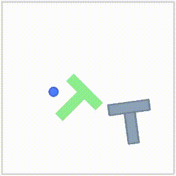

# Bidirectional Decoding

**[`🌐 Website`](https://bid-robot.github.io) | [`📄 Paper`](https://arxiv.org/abs/2408.17355) | [`🤗 BiD + LeRobot`](https://github.com/Jubayer-Hamid/bid_lerobot) | [`🤖 BiD + Diffusion`](https://github.com/YuejiangLIU/bid_diffusion)**

**Bidirectional Decoding: Improving Action Chunking via Guided Test-Time Sampling** \
International Conference on Learning Representations (ICLR) 2025 \
<a href="https://sites.google.com/view/yuejiangliu/">Yuejiang Liu*</a>,
<a href="https://jubayer-hamid.github.io/">Jubayer Ibn Hamid*</a>,
<a href="https://anxie.github.io/">Annie Xie</a>,
<a href="https://yoonholee.com//">Yoonho Lee</a>,
<a href="https://maximiliandu.com/">Maximilian Du</a>,
<a href="https://ai.stanford.edu/~cbfinn/">Chelsea Finn</a> \
IRIS Lab, Stanford University

> Bidirectional Decoding (BID) samples multiple action chunks at each time step and searches for the optimal action based on two criteria:
>   1. backward coherence, which favors actions close to the decision made in the previous time step
>   2. forward contrast, which favors actions close to near-optimal plans and far from sub-optimal ones
>      
> BID improves temporal consistency over multiple time steps, while maintaining high reactivity to stochastic dynamics.

### Setup

Install dependencies of the diffusion policy (approx. 20 min)
```
mamba env create -f conda_environment.yaml
mamba activate bid
```

Install additional dependencies
```
pip install -r requirement.txt
```

Download pre-trained checkpoints
```
gdown https://drive.google.com/drive/folders/1o8rf2Lq91D_DCq7RqZVyFAP-eMcLOAP2 -O . --folder
```

Download [online data](https://diffusion-policy.cs.columbia.edu/data/training/) (optional, required only for model training)
```
bash script/download_dataset.sh
```

### Decoding Scripts

The [sampler](diffusion_policy/sampler) folder contains a collection of test-time sampling/decoding algorithms.

- Vanilla Sampling Baseline
```
bash script/eval_random.sh
```

- Warmstart Diffusion Baseline
```
bash script/eval_warmstart.sh
```

- Temporal Ensembling Baseline (EMA)
```
bash script/eval_ema.sh
```

- Our Bidirectional Decoding (BID)
```
bash script/eval_bid.sh
```

- Dynamic object animations
```
bash script/animate_eval.sh
```

### Expected Results

The [separate.ipynb](notebook/separate.ipynb) script summarizes representative results from different algorithms on the Pust-T task.

<table>
<tr><th> Deterministic (noise=0.0) </th><th> Stochastic (noise=1.0) </th></tr>
<tr><td>

|Method|Result|
|:----|:----|
|Vanilla (ah=1)|0.846|
|Vanilla (ah=8)|0.884|
|Warmstart (ah=8)|0.887|
|EMA (ah=8)|0.866|
|BID (ah=8)|**0.928**|

</td><td>

|Method|Result|
|:----|:----|
|Vanilla (ah=8)|0.582|
|Vanilla (ah=1)|0.805|
|Warmstart (ah=1)|0.852|
|EMA (ah=1)|0.823|
|BID (ah=1)|**0.889**|

</td></tr> </table>

The [animation](animation) folder contains sample videos of different algorithms on the Pust-T task with a dynamic block (`perturb=1.0`). 

| Vanilla Open-Loop          | Vanilla Closed-Loop       | EMA Closed-Loop        | BID Closed-Loop        |
|:-------------------------:|:------------------------:|:----------------------:|:----------------------:|
|  |  |  |  |

The [aggregate.ipynb](notebook/aggregate.ipynb) script summarizes the results of different algorithms on seven simulation tasks over three runs.

<div style="text-align: center;">
  
</div>

BID offers increasing performance gains with larger sample sizes and complements other existing methods, e.g., EMA. 

<div style="text-align: center;">
  
  
</div>

### Citation

If you find this code useful for your research, please consider citing our paper:
```bibtex
@inproceedings{liu2024bid,
  title={Bidirectional Decoding: Improving Action Chunking via Guided Test-Time Sampling},
  author={Yuejiang Liu and Jubayer Ibn Hamid and Annie Xie and Yoonho Lee and Max Du and Chelsea Finn},
  booktitle={The Thirteenth International Conference on Learning Representations},
  year={2025},
  url={https://openreview.net/forum?id=qZmn2hkuzw}
}
```

### Acknowledgement

Our implementation is built upon the [Diffusion Policy](https://github.com/real-stanford/diffusion_policy) codebase
